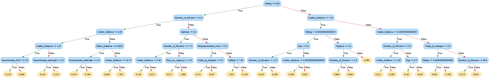

# 🏡 Educational DecisionTreeRegressor from scratch
*A fully-transparent, from-scratch regression decision-tree with built-in visualisation*




---

## ✨ Why I created it?

| What you get | Why it matters |
|--------------|----------------|
| **100 % pure-Python implementation**<br>(no Cython, no compiled extensions) | Easy to read, extend and debug. Ideal for teaching, code-review sessions or exploratory research. |
| **Step-by-step, self-contained code** | Each method mirrors the math you find in textbooks—great for learning how trees calculate variance reduction & information gain. |
| **Handles both numeric *and* categorical data** | Works out-of-the-box on real-world data sets without heavy preprocessing. |
| **Graphviz-powered visualisation CLI** | Instantly export a high-resolution PNG of the trained tree to understand splits at a glance. |
| **sklearn-style API** | Familiar `.fit()` / `.predict()` workflow plus drop-in benchmarking against scikit-learn. |
| **Config-driven hyper-parameters** | Tweak depth, information-gain threshold, category limits and more from a single `config.py` file **or** per-run CLI flags. |

---

## 🚀 Quick start

### 1&nbsp;· Install prerequisites

```bash
# System package needed by Graphviz
# Ubuntu / Debian
sudo apt-get install graphviz

# macOS (Homebrew)
brew install graphviz

# Project dependencies
python -m venv venv           
source venv/bin/activate

pip install -r requirements.txt

```

### 2&nbsp;· Train and evaluate

```python
import pandas as pd
from decision_tree import MyDecisionTreeRegressor
from config import DATA_PATH


df = pd.read_csv(DATA_PATH)
df.columns = df.columns.str.replace(" ", "_")
bool_cols = df.select_dtypes("bool").columns
df[bool_cols] = df[bool_cols].astype(int)
df = df.dropna()

X = df.drop(["Hotel_Name", "Price", "Description"], axis=1)
y = np.log(df["Price"])                


tree = MyDecisionTreeRegressor(max_depth=6,
                               min_samples_split=20,
                               min_information_gain=1e-4)
tree.fit(X, y)

pred = tree.predict(X.head())
print(pred)


```
### 3&nbsp;· Visualise the tree (CLI)

```python
python visualize.py \
    --data          data/hotels.csv \
    --output        my_tree          \
    --max-depth     6               \
    --min-samples-split 20

```

### 4&nbsp;· ??? Profit!!!1!